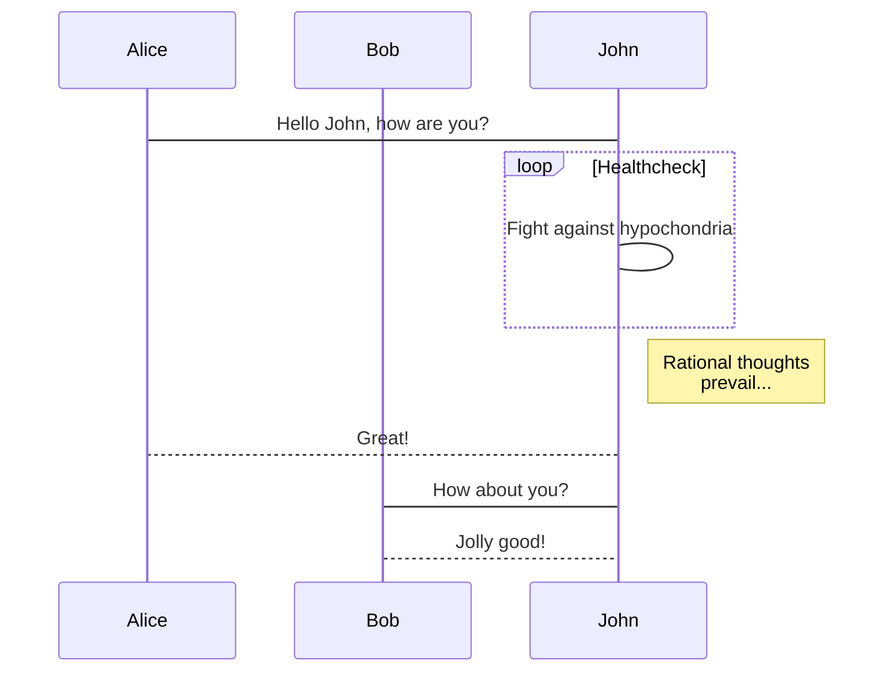
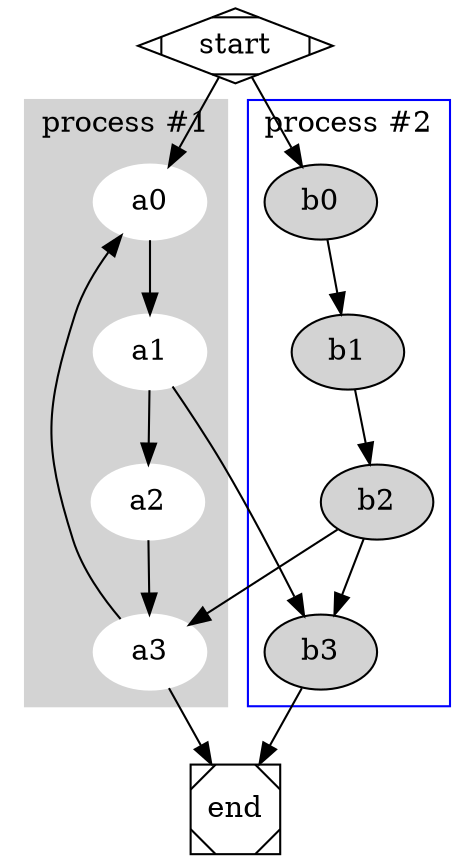
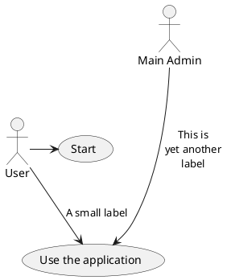

MarkDown 笔记
===========
**NOTE:**本笔记参考了MWeb的[MarkDown语法][1]以及[MarkDown官方繁体中文版文档][2]，**MWeb采用的是Github Favored Markdown语法（GFM语法）**，是官方版本的拓展，**新增支持表格、TOC、LaTex、代码块、任务列表、脚注等**；另外**MWeb进一步拓展GFM，新增支持画图（mermaid, viz, echarts, plantuml, sequence, flow）和设置图片宽度。**

[1]: https://zh.mweb.im/markdown.html
[2]: https://zh.mweb.im/markdown-syntax-guide-full-version-zh.html#link
***

## 目录
+ [概述](#overview)
    + [哲学](#philosophy)
    + [在MarkDown中插入HTML代码](#inlineHTML)
    + [特殊字符自动转换](#autoescape)
+ [区块元素](#block)
    + [标题](#header)
    + [引言](#blockquote)
    + [列表](#list)
    + [分割线](#hr)
+ [内联元素](#inline)
    + [链接](#link)
    + [字体样式](#style)
    + [代码](#code)
    + [图片](#img)
+ [其他](#other)
    + [转义字符](#escapecharacter)
    + [自动链接](#autolink)
+ [GFM拓展](#GFMExtended)
    + [表格](#table)
    + [任务列表](#task)
    + [LaTex](#LaTex)
    + [TOC](#TOC)
    + [脚注](#footnote)
+ [MWeb拓展](#MWEBExtended)
    + [画图](#draw)

<h2 id='overview'>概述</h2>

<h3 id='philosophy'>哲学</h3>

MarkDown的目标是***易读易写***，最强调的是它的可读性。Markdown文件应该可以直接以纯文字形式发布，并且看起来不会像是由许多标签或者格式指令所构成。
 
<h3 id='inlineHTML'>在MarkDown中插入HTML代码</h3>

**在Markdown文件中，可以使用HTML代码。**（比如本文档的标题就是使用HTML中的\<h2>标题和\<h3>标题）。
1. **使用HTML区块元素**（`<div>, <table>, <pre>, <p>...`）**时，必须在必须在前后加上空行，区块元素的开始与结束标签不可以用tab或空格来缩进；Markdown语法在HTML区块元素中失效（将不会被处理）。**

    举例说明，在Markdown文件里加上一段HTML表格区块元素：

        This is a regular paragraph.

        <table>
            <tr>
                <td>Foo</td>
            </tr>
        </table>

        This is another regular paragraph.

2. **可以随意使用HTML内联元素**（`<span>, <cite>, <del>`），**Markdown语法在HTML内联元素中仍有效（将会被处理）。**举例说明：如果比较喜欢HTML的`<a>`或``标签，可以直接使用这些标签，而不用Markdown提供的链接或者图像语法。

<h3 id='autoescape'>特殊字符自动转换</h3>

1. **在Markdown中，如果你是在HTML实体中使用`&`符号，它不会被自动转换，而在其他情形下，它则会被转换成`&amp;`。**所以你如果要在文件中插入一个著作权的符号，你可以这样写：
    
        \&copy;
    
    Markdown将不会对这段文字做修改，但是如果你这样写：
    
        AT&T
    
    Markdown就会将它转为：
    
        AT\&amp;T
    
2. **如果使用`<`符号作为HTML标签使用，它不会被自动转换，而在其他情形下，它则会被转换成`&lt;`。**如果你写：
    
        4 < 5
    
    Markdown将会把它转换成：
    
        4 \&lt; 5
    
<h2 id='block'>区块元素</h2>

<h3 id='paragraph'>段落与换行</h3>

**换行**
**四个及以上空格加回车。**
如果不想打这么多空格，只要回车就换行，请打开`偏好设置`-`主题&样式`勾选：`把换行转为<br />标签`,这项默认是勾选状态。

<h3 id='header'>标题</h3>

    # 第一级标题 `<h1>`
    ## 第二级标题 `<h2>`
    ### 第三级标题 `<h3>`
    #### 第四级标题 `<h4>`
    ##### 第五级标题 `<h5>`
    ###### 第六级标题 `<h6>`

也可以使用HTML的标题标签\<h数字\>来表示标题，标题效果如下：
# 第一级标题 `<h1>`
## 第二级标题 `<h2>`
### 第三级标题 `<h3>`
#### 第四级标题 `<h4>`
##### 第五级标题 `<h5>`
###### 第六级标题 `<h6>`

<h3 id='blockquote'>引言</h3>

1. **每行前面加`>`符号或者只在整个段落的第一行最前面加`>`符号**，举例如下：

        某某说：
        > 第一行引用
        > 第二行引用文字，你好啊，yoyoy，给力给力，blabla，
        我也不知道我在打什么
        > 你好

    效果如下：
    某某说：
    > 第一行引用
    > 第二行引用文字，你好啊，yoyoy，给力给力，blabla，
      我也不知道我在打什么
    > 你好

2. **引言也可以嵌套（有阶层）**，例如：引言内的引言。
    
        > This is the first level of quoting.
        >
        > > This is nested blockquote.
        >
        > Back to the first level.

    效果如下：    
    > This is the first level of quoting.
    >
    > > This is nested blockquote.
    >
    > Back to the first level.

<h3 id='list'>列表</h3>

1. **无序列表使用星号`*`、加号`+`或者减号`-`来表示，使用缩进来表示子列表**：
    
        * 列表一 无序列表 `* + 空格键`
        * 列表二 
            * 列表二的子列表1 无序列表 `TAB +  * + 空格键`
            * 列表二中的子列表2
        
    效果如下：
        
    * 列表一 无序列表 `* + 空格键`
    * 列表二 
        * 列表二的子列表1 无序列表 `TAB +  * + 空格键`
        * 列表二中的子列表2
    
2. **有序列表使用`数字 + . + 空格键`表示，使用缩进来表示子列表**：
    
        1. 列表一 有序列表 `数字 + . + 空格键`
        2. 列表二
        3. 列表三
            1. 列表三的子列表1 有序列表 `TAB + 数字 + . + 空格键`
            2. 列表三的子列表2
    
    效果如下：
    1. 列表一 有序列表 `数字 + . + 空格键`
    2. 列表二
    3. 列表三
        1. 列表三的子列表1 有序列表 `TAB + 数字 + . + 空格键`
        2. 列表三的子列表2
    
<h3 id='hr'>分割线</h3>

以下三种方式都可以生成分割线：

    ***
    *****
    - - -

<h2 id='inline'>内联元素</h2>

<h3 id='link'>链接</h3>

**Markdown支持两种链接语法：内联链接和参考链接。**
1. **内联链接：`[链接文字]（链接url 'Optional Title Here'）`或者`<链接url 'Optional Title Here'>`。可以使用相对路径来链接到本主机上的资源**，例子：
        
        See my [About](/about/) page for details.
    
2. **参考链接：`[链接文字][参考id]`或者`[链接文字][]`，并在文件任意处定义链接内容**:
        
        [参考id]: 链接url "Optional Title Here"
           
    或者
    
        [链接文字]: 链接url "Optional Title Here"    

<h3 id='style'>字体样式</h3>

*斜体* `*斜体*`
_下划线_ `_下划线_`
**加粗** `**加粗**`
__加粗__ `__加粗__`(两个下划线)
***斜体并加粗*** `***斜体并加粗***`
~~删除线~~ `~~删除线~~`

<h3 id='code'>代码</h3>

**Markdown支持两种代码：内联代码和多行代码（代码段）**。
1. **内联代码：\`代码\`;**
2. **代码段：**

        ```js
        function fancyAlert(arg){
            if(arg){
                $.facebox({div:'#foo'})
            }
        }
        ```
    
    效果如下：
    ```js
    function fancyAlert(arg){
        if(arg){
            $.facebox({div:'#foo'})
        }
    }
    ```
    
<h3 id='img'>图片</h3>

**Markdown支持两种图片：内联图片和参考图片。**
1. **内联图片：`![图片描述]（图片url）`**
2. **参考图片：`![图片描述][参考id]`或者`![图片描述][]`，并在文件任意处定义图片内容**

        [id]: url/to/image "Optional title attribute"
    
    或者
        
        [图片描述]: url/to/image "Optional title attribute"

**Mweb拓展：**
1. **设置图片宽度：``**
2. **设置图片对齐方式：左对齐``，右对齐``或者居中``**。

<h2 id='other'>其他</h2>

<h3 id='escapecharacter'>转义字符</h3>

使用反斜线`\`来转义特殊字符

<h3 id='autolink'>自动链接</h3>

自动链接格式：<链接url>

<h2 id='GFMExtended'>GFM拓展</h2>

<h3 id='table'>表格</h3>

表格语法：
```
第一格表头 | 第二格表头
--------- | -------------
内容单元格 第一列第一格 | 内容单元格第二列第一格
内容单元格 第一列第二格 多加文字 | 内容单元格第二列第二格
```
效果如下：

第一格表头 | 第二格表头
--------- | -------------
内容单元格 第一列第一格 | 内容单元格第二列第一格
内容单元格 第一列第二格 多加文字 | 内容单元格第二列第二格

<h3 id='task'>任务列表</h3>

**任务列表语法：待完成`- [] `或者已完成`- [x] `**
```
- [ ] 任务一 未做任务 `- + 空格 + [ ]`
- [x] 任务二 已做任务 `- + 空格 + [x]`
```
效果如下：

- [ ] 任务一 未做任务 `- + 空格 + [ ]`
- [x] 任务二 已做任务 `- + 空格 + [x]`

<h3 id='LaTex'>LaTex</h3>

Markdown 语法：

```
块级公式：
$$	x = \dfrac{-b \pm \sqrt{b^2 - 4ac}}{2a} $$

\\[ \frac{1}{\Bigl(\sqrt{\phi \sqrt{5}}-\phi\Bigr) e^{\frac25 \pi}} =
1+\frac{e^{-2\pi}} {1+\frac{e^{-4\pi}} {1+\frac{e^{-6\pi}}
{1+\frac{e^{-8\pi}} {1+\ldots} } } } \\]

行内公式： $\Gamma(n) = (n-1)!\quad\forall n\in\mathbb N$
```

效果如下（如果没看到公式，请勾选 `偏好设置` - `主题&样式` - `启用 LaTeX（MathJax）` 即可）：

块级公式：
$$	x = \dfrac{-b \pm \sqrt{b^2 - 4ac}}{2a} $$

\\[ \frac{1}{\Bigl(\sqrt{\phi \sqrt{5}}-\phi\Bigr) e^{\frac25 \pi}} =
1+\frac{e^{-2\pi}} {1+\frac{e^{-4\pi}} {1+\frac{e^{-6\pi}}
{1+\frac{e^{-8\pi}} {1+\ldots} } } } \\]


行内公式： $\Gamma(n) = (n-1)!\quad\forall n\in\mathbb N$

<h3 id='TOC'>TOC</h3>

自动生成目录语法：`[TOC]`

效果如下：
[TOC]

<h3 id='footnote'>脚注</h3>

Markdown 语法：

```
这是一个脚注：[^sample_footnote]
```

效果如下：

这是一个脚注：[^sample_footnote]

[^sample_footnote]: 这里是脚注信息

<h2 id='MWEBExtended'>Mweb拓展</h2>

<h3 id='draw'>画图</h3>

### mermaid

mermaid 是比较流行的画图库，它支持流程图、顺序图和甘特图，它的官网为：<https://mermaidjs.github.io/> ，在 MWeb 中使用 mermaid 的语法就是声明代码块的语言为 mermaid，代码块中再写上 mermaid 的画图语法即可，你可以把下面的语法复制到 MWeb 中查看效果。

    ```mermaid
    sequenceDiagram
        participant Alice
        participant Bob
        Alice->John: Hello John, how are you?
        loop Healthcheck
            John->John: Fight against hypochondria
        end
        Note right of John: Rational thoughts <br/>prevail...
        John-->Alice: Great!
        John->Bob: How about you?
        Bob-->John: Jolly good!
    ```
 
**效果如下：**
 

    
### Graphviz

Graphviz 是开源的画图软件，它的官网为 <http://www.graphviz.org/>。MWeb 采用的是 Graphviz 的 js 版本的实现 <http://viz-js.com/>，可以解析 Graphviz 语法以生成图片。你可以将以下语法复制到 MWeb 中进行尝试。在尝试时可以把 dot 换成 circo, fdp, neato, osage, twopi 这几种来尝试效果。

    ```dot
    # http://www.graphviz.org/content/cluster
    digraph G {
    
    	subgraph cluster_0 {
    		style=filled;
    		color=lightgrey;
    		node [style=filled,color=white];
    		a0 -> a1 -> a2 -> a3;
    		label = "process #1";
    	}
    
    	subgraph cluster_1 {
    		node [style=filled];
    		b0 -> b1 -> b2 -> b3;
    		label = "process #2";
    		color=blue
    	}
    	start -> a0;
    	start -> b0;
    	a1 -> b3;
    	b2 -> a3;
    	a3 -> a0;
    	a3 -> end;
    	b3 -> end;
    
    	start [shape=Mdiamond];
    	end [shape=Msquare];
    }
    ```

**效果如下：**



### echarts

echarts 是百度出口的 js 画图库，它的网址为：<http://echarts.baidu.com/index.html>，功能非常强大，MWeb 支持 echarts 的一些基本的用法，太高级的不支持。你可以将以下语法复制到 MWeb 中进行尝试。你也可以去 <http://echarts.baidu.com/examples/index.html> 这个网址查看一些例子，要注意的是 MWeb 只能解析 `option = {}` 这种简单的，不过应该是足够使用了。

    ```echarts
    option = {
        xAxis: {
            type: 'category',
            data: ['Mon', 'Tue', 'Wed', 'Thu', 'Fri', 'Sat', 'Sun']
        },
        yAxis: {
            type: 'value'
        },
        series: [{
            data: [820, 932, 901, 934, 1290, 1330, 1320],
            type: 'line'
        }]
    };
    ```

**效果如下：**

```echarts
option = {
    xAxis: {
        type: 'category',
        data: ['Mon', 'Tue', 'Wed', 'Thu', 'Fri', 'Sat', 'Sun']
    },
    yAxis: {
        type: 'value'
    },
    series: [{
        data: [820, 932, 901, 934, 1290, 1330, 1320],
        type: 'line'
    }]
};
```
### plantuml

plantuml 的网址为：<http://www.plantuml.com/>，直接上去看更能了解。MWeb 对 plantuml 的支持的方式是引用 plantuml 服务器生成的图片，你可以将以下语法复制到 MWeb 中进行尝试。

    ```plantuml
    @startuml
    
    User -> (Start)
    User --> (Use the application) : A small label
    
    :Main Admin: ---> (Use the application) : This is\nyet another\nlabel
    
    @enduml
    ```

**效果如下：**



### 顺序图和流程图

顺序图和流程图是使用 <http://bramp.github.io/js-sequence-diagrams/>, <http://adrai.github.io/flowchart.js/> 这两个画图库，以下是它在 MWeb 中的 Markdown 语法。

	```sequence
	张三->李四: 嘿，小四儿, 写博客了没?
	Note right of 李四: 李四愣了一下，说：
	李四-->张三: 忙得吐血，哪有时间写。
	```

	```flow
	st=>start: 开始
	e=>end: 结束
	op=>operation: 我的操作
	cond=>condition: 确认？

	st->op->cond
	cond(yes)->e
	cond(no)->op
	```

**效果如下：**

```sequence
张三->李四: 嘿，小四儿, 写博客了没?
Note right of 李四: 李四愣了一下，说：
李四-->张三: 忙得吐血，哪有时间写。
```

```flow
st=>start: 开始
e=>end: 结束
op=>operation: 我的操作
cond=>condition: 确认？

st->op->cond
cond(yes)->e
cond(no)->op
```


